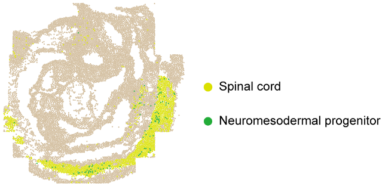
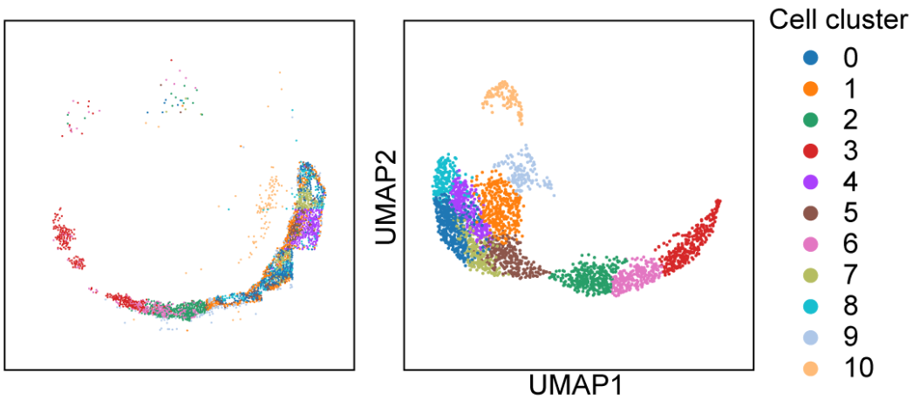
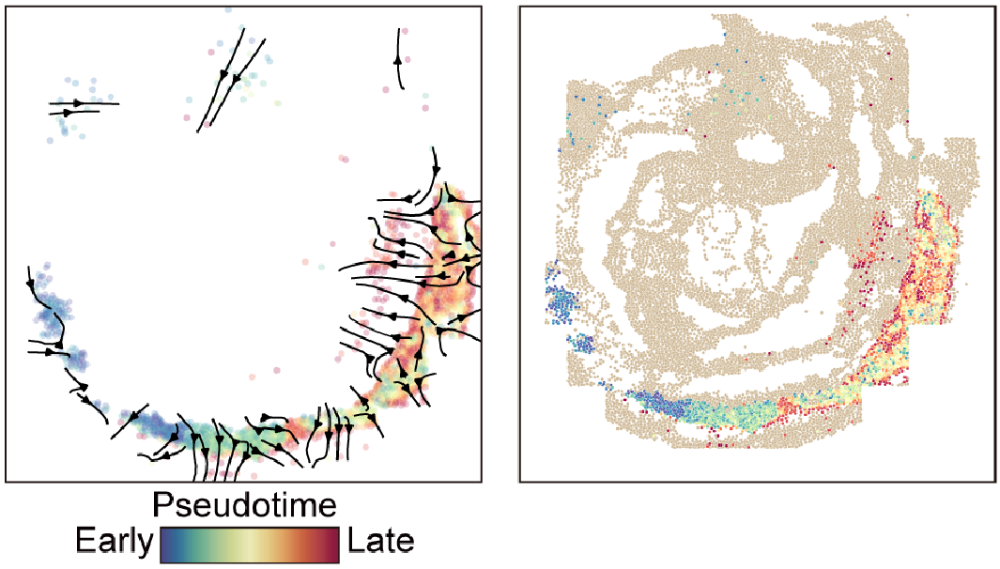
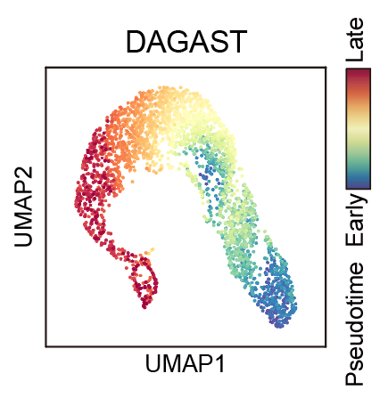
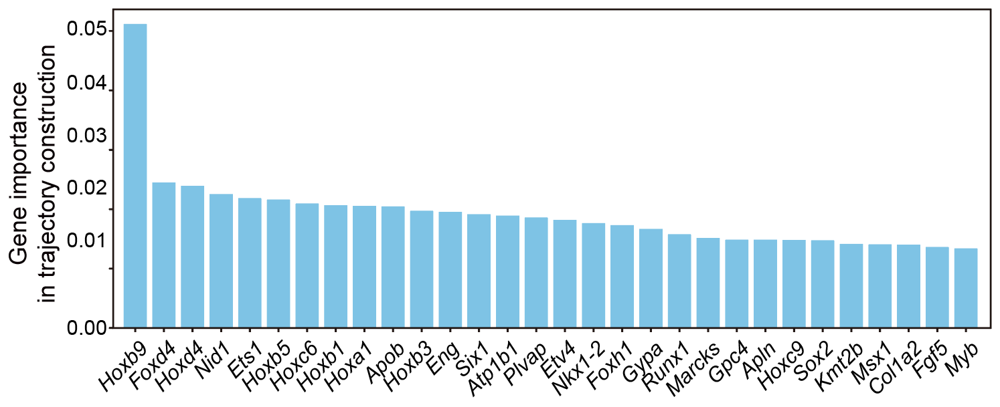
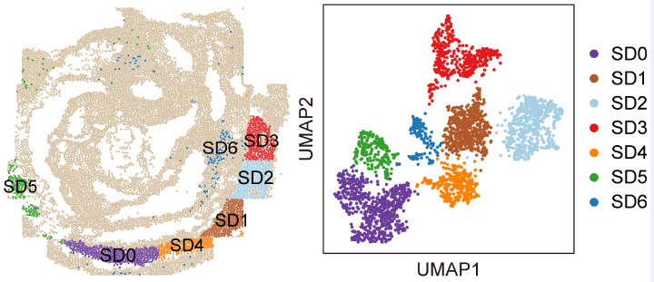
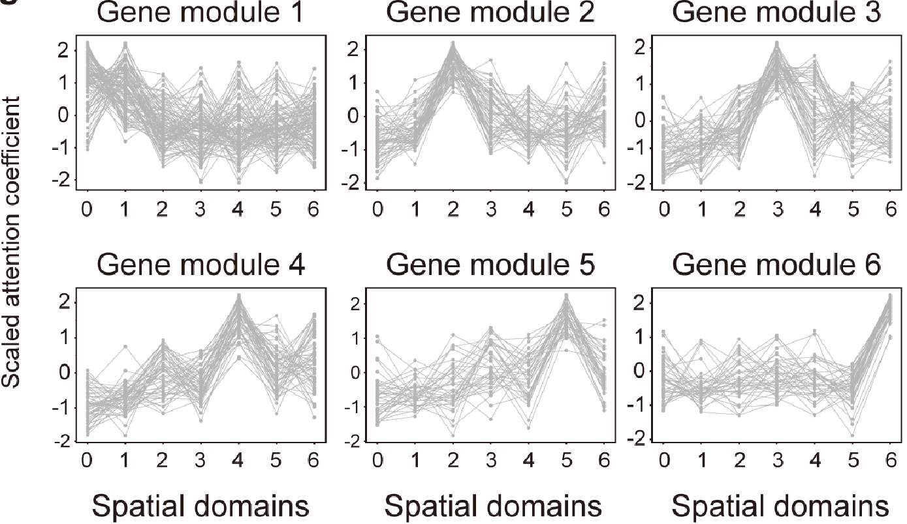
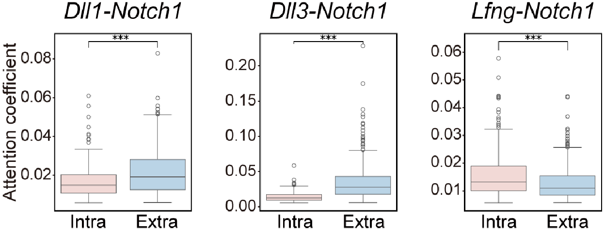

# Tutorial 1: Application on SeqFISH mouse embryo dataset. 
In this section, we will demonstrate the use of `DAGAST` on the [SeqFISH dataset(Lohoff, T. et al. 2022)](https://doi.org/10.1038/s41587-021-01006-2) for spatial trajectory inference and regulatory network deciphering. The original data can be downloaded from the https://marionilab.cruk.cam.ac.uk/SpatialMouseAtlas/, and the demonstration data uses Embryo1.

---

### 1.Load DAGAST and set path

    import os 
    import torch
    import numpy as np
    import pandas as pd
    import scanpy as sc
    import seaborn as sns
    import matplotlib.pyplot as plt
    from tqdm import tqdm

    import DAGAST as dt     # import DAGAST

    import warnings
    warnings.filterwarnings("ignore")
    torch.cuda.empty_cache()   

    ## version and path
    sample_name = "DAGAST"
    root_path = "/public3/Shigw/"
    data_folder = f"{root_path}/datasets/SeqFISH/"
    save_folder = f"{data_folder}/results/{sample_name}"
    dt.check_path(save_folder)

### 2.Set Hyperparameters 

    SEED = 24
    knn = 30
    n_neighbors = 9
    n_externs = 10

    dt.setup_seed(SEED)
    torch.cuda.empty_cache()     
    device = torch.device('cuda:1')
    args = {
        "num_input" : 351,  
        "num_emb" : 256,        # 256  512
        "dk_re" : 16,
        "nheads" : 1,               #  1    4
        "droprate" : 0.15,          #  0.25,
        "leakyalpha" : 0.15,        #  0.15,
        "resalpha" : 0.5, 
        "bntype" : "BatchNorm",     # LayerNorm BatchNorm
        "device" : device, 
        "info_type" : "nonlinear",  # nonlinear
        "iter_type" : "SCC",
        "iter_num" : 200,

        "neighbor_type" : "extern",
        "n_neighbors" : 9,
        "n_externs" : 10,

        "num_epoch1" : 1000, 
        "num_epoch2" : 1000, 
        "lr" : 0.001, 
        "update_interval" : 1, 
        "eps" : 1e-5,
        "scheduler" : None, 
        "SEED" : 24,

        "cutof" : 0.1,
        "alpha" : 1.0,
        "beta" : 0.1,
        "theta1" : 0.1,
        "theta2" : 0.1
    }

    celltypes = ['Spinal cord', 'NMP']      # target cell

### 3.Load dataset

    st_data = sc.read_h5ad(data_folder + "/st_data.h5ad")
    sc.pp.normalize_total(st_data, target_sum=1e4)          
    sc.pp.log1p(st_data)
    sc.pp.scale(st_data)
    st_data_use = st_data[st_data.obs.celltypes.isin(celltypes), :].copy()   ## target data 

    ## show data
    dt.plot_spatial_complex(
        st_data, st_data_use, mode="cluster", key="celltypes",
        figsize=(5, 5), title=None, pointsize=5, 
        savename=f"{save_folder_cluster}/spatial_sel_cell.png"
    )

### 4.Building and training the DAGAST model
#### 4.1 Stage 1 training
    save_folder_cluster = f"{save_folder}/2.spatial_cluster/"
    dt.check_path(save_folder_cluster)

    trainer = dt.DAGAST_Trainer(args, st_data, st_data_use) # Build DAGAST Trainer
    trainer.init_train()                                    # Build Model, neighbor
    trainer.train_stage1(f"{save_folder_cluster}/model_{sample_name}_stage1.pkl") 

#### 4.2 Select the starting cell cluster
    ## Select starting area (available separately)
    model = torch.load(f"{save_folder_cluster}/model_{sample_name}_stage1.pkl")
    model.eval()
    emb = model.get_emb(isall=False)
    emb_adata = sc.AnnData(emb)
    emb_adata.obs['celltypes'] = st_data_use.obs['celltypes'].values
    sc.pp.neighbors(emb_adata, use_rep='X', n_neighbors=20)
    sc.tl.umap(emb_adata)
    sc.tl.leiden(emb_adata, resolution=1.0)         # res = 0.1
    print(f"{len(emb_adata.obs['leiden'].unique())} clusters")

    plt.close('all')
    fig = plt.figure(figsize=(10, 10))
    plt.subplot(1, 1, 1)
    ax = sc.pl.umap(emb_adata, color="leiden", color_map='Spectral_r', legend_loc='on data', legend_fontweight='normal')
    plt.savefig(f"{save_folder_cluster}/2.umap_cluster_stage1.pdf", dpi=600)

    st_data_use.obs['emb_cluster'] = emb_adata.obs['leiden'].values
    plt.close('all')
    plt.rcParams["figure.figsize"] = (5, 5)
    ax = sc.pl.embedding(st_data_use, basis="spatial", color="emb_cluster",size=15, s=10, show=False, title='clustering')
    plt.axis('off')
    plt.savefig(f"{save_folder_cluster}/2.spatial_cluster_stage1.pdf", dpi=600, bbox_inches='tight')

#### 4.3 Stage 2 training
    save_folder_trajectory = f"{save_folder}/3.spatial_trajectory/"
    dt.check_path(save_folder_trajectory)

    flag = (st_data_use.obs['emb_cluster'].isin(['3'])).values   

    trainer.set_start_region(flag)                                  # set start region
    trainer.train_stage2(save_folder_trajectory, sample_name)       # Trajectory inference
    trainer.get_Trajectory_Ptime(knn, grid_num=50, smooth=0.5, density=0.7) 

### 5.Plot results

    st_data, st_data_use = trainer.st_data, trainer.st_data_use
    model = trainer.model

    xy1 = st_data.obsm['spatial']
    xy2 = st_data_use.obsm['spatial']

#### 5.1 Spatial differentiation trajectory
    plt.close('all')
    fig, axs = plt.subplots(figsize=(5, 5))
    sns.scatterplot(x = xy2[:, 0], y = xy2[:, 1], marker = 'o', c = st_data_use.obs['ptime'], s=20, cmap='Spectral_r', legend = False, alpha=0.25)
    axs.quiver(st_data_use.uns['E_grid'][0], st_data_use.uns['E_grid'][1], st_data_use.uns['V_grid'][0], st_data_use.uns['V_grid'][1], 
        scale=0.2, linewidths=4, headwidth=5)
    plt.savefig(f"{save_folder_trajectory}/1.spatial_quiver.pdf", format='pdf',bbox_inches='tight')

#### 5.2 Spatial pseudotime
    dt.plot_spatial_complex(
        st_data, st_data_use, mode="time",
        value=st_data_use.obs['ptime'], title="ptime", pointsize=5,
        savename=f"{save_folder_trajectory}/2.spatial_Pseudotime.pdf"
    )

#### 5.3 UMAP visualization of spatial pseudotime
    model.eval()
    emb = model.get_emb(isall=False)
    adata = sc.AnnData(emb)
    sc.pp.neighbors(adata, use_rep='X', n_neighbors=knn)
    adata.obs['ptime'] = st_data_use.obs['ptime'].values
    adata.obs['celltypes'] = st_data_use.obs['celltypes'].values
    sc.tl.umap(adata)

    plt.close('all')
    fig = plt.figure(figsize=(10, 10))
    plt.subplot(1, 1, 1)
    ax = sc.pl.umap(adata, color="ptime", color_map='Spectral_r')
    plt.savefig(f"{save_folder_trajectory}/3.umap_ptime.pdf")

### 6.Downstream analysis

#### 6.1 Gene contribution scores to cell differentiation trajectory reconstruction
    ## 导入模型和迁移矩阵(/public3/Shigw/datasets/SeqFISH/results/250116/3.spatial_trajectory)
    ci = 'Spinal cord'
    celltypes = ['Spinal cord', 'NMP']      # permutation cells

    cell_use = st_data_use.obs_names[st_data_use.obs['celltypes'].isin(celltypes)].tolist()
    gene_use = st_data_use.var_names.tolist()

    trj_ori = np.load(f"{save_folder_trajectory}/trj_{sample_name}.npy")
    model = torch.load(f"{save_folder_trajectory}/model_{sample_name}.pkl")

    nu.setup_seed(SEED)
    torch.cuda.empty_cache()     
    device = torch.device('cuda:1')
    result_permu = permutation_singlegene_celltype(      # 单个扰动
        model, st_data_sel, trj_ori, gene_use, cell_use,
        n_permu=30, epsilon=1e-16, seed=24, device=device
    )

    result_permu_df = pd.DataFrame(result_permu.mean(1), index=gene_use, columns=['total_sim'])
    result_permu_sorted = result_permu_df.sort_values('total_sim', ascending=False)
    result_permu_sorted.to_csv(f"{save_folder_trajectory}/5.permutation_single_gene_{ci}.csv")
    result_permu_sorted = pd.read_csv(f"{save_folder_trajectory}/5.permutation_single_gene_{ci}.csv", index_col=0)

    ## 绘制条形图
    plt.close('all')
    plt.figure(figsize=(10, 6))
    plt.bar(result_permu_sorted.head(30).index, result_permu_sorted.head(30).total_sim, color='skyblue')
    plt.xticks(rotation=45)
    plt.xlabel('Gene', fontsize=12)
    plt.ylabel('Mean of KL divergence', fontsize=12)
    plt.savefig(f"{save_folder_trajectory}/0929.barplot_gene_top30.pdf")

#### 6.2 The synergistic “cell-autonomous and microenvironment interaction” regulatory network

    from utils_function import *

    sample_name = "250418"
    root_path = "/public3/Shigw/"
    data_folder = f"{root_path}/datasets/SeqFISH/"
    save_folder = f"{data_folder}/results/{sample_name}"
    check_path(save_folder)

    ######################### 准备数据和模型 ########################
    save_folder_trajectory = f"{save_folder}/3.spatial_trajectory/"
    nu.check_path(save_folder_trajectory)

    ##### 导入数据
    st_data = sc.read_h5ad(data_folder + "/st_data.h5ad")
    sc.pp.normalize_total(st_data, target_sum=1e4) # 不要和log顺序搞反了 ，这个是去文库的
    sc.pp.log1p(st_data)
    sc.pp.scale(st_data)

    celltypes = ['Spinal cord', 'NMP']      # permutation cells
    st_data_use = st_data[st_data.obs.celltypes.isin(celltypes), :].copy()

    n_neighbors = 9
    n_externs = 10
    kNNGraph_use, indices_use, st_data_sel = get_neighbor(st_data, st_data_use, n_neighbors=n_neighbors, n_externs=n_externs, ntype="extern")

    ##### 导入模型和迁移矩阵
    SEED = 42
    nu.setup_seed(SEED)
    trj_ori = np.load(f"{save_folder_trajectory}/trj_{sample_name}.npy")
    model = torch.load(f"{save_folder_trajectory}/model_{sample_name}.pkl")

    model.eval()
    att_gene_re_all, att_gene_cc_all, att_cell_all = model.get_encoder_attention()

    att_gene_re = att_gene_re_all[indices_use]
    att_gene_cc = att_gene_cc_all[indices_use]
    att_cell = att_cell_all[indices_use]

    celltypes_list = np.array(st_data_use.obs.celltypes.tolist())

    save_folder_attention_gene = "/public3/Shigw/datasets/Stereo-seq/regeneration/results/DAGAST/test/test"
    nu.check_path(save_folder_attention_gene)

    ### 对比细胞内外gene attention，得到坐标相同的两个注意力系数矩阵
    ci = 'Spinal cord'
    cell_use = st_data_use.obs_names[st_data_use.obs['celltypes'].isin(celltypes_list)].tolist()
    gene_use = st_data_use.var_names.tolist()

    save_folder_attention_gene_ci = f"{save_folder_attention_gene}/{ci}/"
    nu.check_path(save_folder_attention_gene_ci)
    saveFolder_geneAtt_01module = f"{save_folder_attention_gene_ci}/1.module/"
    nu.check_path(saveFolder_geneAtt_01module)

    ## 提取细胞外gene attention
    flag = (celltypes_list == ci)
    att_gene_cc_sel = att_gene_cc[flag]
    att_gene_cc_sel_df = pd.DataFrame(np.mean(att_gene_cc_sel, 0), index=gene_use, columns=gene_use)

    ## 提取细胞内gene attention
    att_gene_re_sel = att_gene_re[flag]
    att_gene_re_sel_df = pd.DataFrame(np.mean(att_gene_re_sel, 0), index=gene_use, columns=gene_use)
    #### 6.2.1 Spatial domains based on extracellular attention coefficients
    # 聚类并提取顺序（按行）
    saveFolder_geneAtt_02spatialModule = f"{save_folder_attention_gene_ci}/2.spatialModule/"
    nu.check_path(saveFolder_geneAtt_02spatialModule)

    ## 分类别
    nu.setup_seed(SEED)
    nc, ng, ng = att_gene_cc_sel.shape
    att_gene_cc_sel_reshape = att_gene_cc_sel.reshape(nc, ng * ng)

    ## 表达模式
    adata_geneatt = sc.AnnData(att_gene_cc_sel_reshape)
    sc.pp.pca(adata_geneatt)
    sc.pp.neighbors(adata_geneatt, n_neighbors=30, n_pcs=50)
    sc.tl.umap(adata_geneatt)
    sc.tl.leiden(adata_geneatt, resolution=0.3)         # res = 0.5
    print(f"{len(adata_geneatt.obs['leiden'].unique())} clusters")
    adata_geneatt.write_h5ad(f"{saveFolder_geneAtt_02spatialModule}/adata_geneatt.h5")

    ## 绘制一下UMAP的类别标签
    plt.close('all')
    fig = plt.figure(figsize=(10, 10))
    plt.subplot(1, 1, 1)
    ax = sc.pl.umap(
        adata_geneatt, color="leiden", 
        palette={ci : mycolor[int(idx)] for idx, ci in enumerate(adata_geneatt.obs['leiden'].unique())}, 
        legend_loc='on data', legend_fontweight='normal')
    plt.savefig(f"{saveFolder_geneAtt_02spatialModule}/2.umap_cluster_cc1.pdf")

    ## 看是否有空间上连续性 
    st_data_use_sel = st_data_use[flag, :]
    st_data_use_sel.obs['emb_cluster'] = adata_geneatt.obs.leiden.values
    nu.plot_spatial(
        st_data, st_data_use_sel, mode="cluster",
        value=st_data_use_sel.obs['emb_cluster'], title="subcluster",
        savename=f"{saveFolder_geneAtt_02spatialModule}/2.spatial_{ci}_subcluster1.pdf"
    )

#### 6.2.2 Identification of gene modules associated with spatial domains
    geneatts = []
    adata_geneatt_label = ['5', '0', '4', '1', '2', '3', '6']
    df_gene_attention = pd.DataFrame(index=gene_use)
    for cj in adata_geneatt_label:
        flag_ci = adata_geneatt.obs.leiden == cj
        att_gene_sel_cj = pd.DataFrame(np.mean(att_gene_cc_sel[flag_ci], 0), index=gene_use, columns=gene_use)

        df_gene_attention[cj] = att_gene_sel_cj.sum(0)
        geneatts.append(att_gene_cc_sel[flag_ci])

    row_mean = df_gene_attention.mean(axis=1)
    row_std = df_gene_attention.std(axis=1)
    df_gene_attention = df_gene_attention.sub(row_mean, axis=0).div(row_std, axis=0)

    nu.setup_seed(SEED)
    adata_geneatt_patten = sc.AnnData(df_gene_attention)
    adata_geneatt_patten.var['index'] = [x for x in range(len(adata_geneatt_patten.var_names))]
    sc.pp.neighbors(adata_geneatt_patten, use_rep='X', n_neighbors=30)
    sc.tl.leiden(adata_geneatt_patten, resolution=1.0)         # res = 0.1
    print(f"{len(adata_geneatt_patten.obs['leiden'].unique())} clusters")

    for ci in adata_geneatt_patten.obs['leiden'].unique():
        sub_adata_geneatt = adata_geneatt_patten[adata_geneatt_patten.obs.leiden == ci].copy()
        sub_adata_geneatt = sub_adata_geneatt.T

        plt.close('all')
        fig = plt.figure(figsize=(8, 5))
        plt.subplot(1, 1, 1)

        for cj, gene in enumerate(sub_adata_geneatt.var_names):
            sub_adata_geneatt.obs['plot'] = sub_adata_geneatt[:, gene].X.T[0].tolist()
            plt.plot(sub_adata_geneatt.obs['index'], sub_adata_geneatt.obs['plot'], marker='o', label=gene)

        plt.xticks(np.arange(len(sub_adata_geneatt)), sub_adata_geneatt.obs_names.tolist())
        plt.title(f'gene Patten {ci}')
        plt.xlabel('class') 
        plt.ylabel('Att.')
        plt.savefig(f"{saveFolder_geneAtt_02spatialModule}/cc_patten_{ci}.pdf")

        print(ci)
    adata_geneatt_patten.write_h5ad(f"{saveFolder_geneAtt_02spatialModule}/adata_geneatt_patten.h5")

#### 6.2.3 Intracellular and extracellular attention coefficients for feature genes in a given spatial domain

    def boxplot_geneAtt(gene_leg, gene_rec, att_re_patten, att_cc_patten, star_type='mean', sorted_types=['re', 'cc'], cutrate = 1):
        from scipy.stats import ttest_rel

        gi = gene_use.index(gene_rec)
        gj = gene_use.index(gene_leg)

        list_re = att_re_patten[:, gi, gj]
        list_cc = att_cc_patten[:, gi, gj]

        cut = cutrate / 351
        f1 = list_re >= cut
        f2 = list_cc >= cut
        ff = f1 & f2

        df_data_re = pd.DataFrame({'att' : list_re[ff], 'label' : 're'})
        df_data_cc = pd.DataFrame({'att' : list_cc[ff], 'label' : 'cc'})
        df_data = pd.concat([df_data_re, df_data_cc], axis=0)

        if star_type == 'mean':
            mean_values = df_data.groupby('label')['att'].mean().sort_values(ascending=False)
        else:
            median_values = df_data.groupby('label')['att'].median().sort_values(ascending=False)

        df_data['label'] = pd.Categorical(df_data['label'], categories=sorted_types, ordered=True)

        # 绘制箱型图
        plt.figure(figsize=(4, 5))
        sns.boxplot(x='label', y='att', data=df_data, order=sorted_types, palette='Set2')

        for idx, type_ in enumerate(sorted_types):      # 添加平均值标记
            mean_value = mean_values[type_]
            plt.scatter(idx, mean_value, color='red', s=20, marker='*', zorder=5)

        # 添加显著性标记
        _, p_value = ttest_rel(list_re[ff], list_cc[ff])  # 独立样本 t 检验

        # 设置显著性标记
        if p_value < 0.001:
            sig = '***'
        elif p_value < 0.01:
            sig = '**'
        elif p_value < 0.05:
            sig = '*'
        else:
            sig = 'ns'

        # 在箱型图上添加标记
        x1, x2 = 0, 1  # 两组的索引
        y, h = df_data['att'].max() + 0.003, 0.003  # 显著性标记的高度和间距
        plt.plot([x1, x1, x2, x2], [y, y+h, y+h, y], lw=1.0, color='black')
        plt.text((x1 + x2) * 0.5, y + h, sig, ha='center', va='bottom', color='black', fontsize=10)

        plt.xticks(rotation=90)
        plt.title(f'{gene_leg} - {gene_rec}', fontsize=12)
        plt.xlabel('celltype', fontsize=10)
        plt.ylabel('att.', fontsize=10)
        plt.tight_layout()
        plt.savefig(f"{save_folder_attention_gene_ci_patten}/boxplot_{gene_leg}_{gene_rec}.pdf")

    def attention_t_test(index_row, att_gene_re_sel_df_patten, att_gene_cc_sel_df_patten, alpha = 0.01, cutrate = 1):
        from scipy.stats import ttest_rel
    
        df_ans = pd.DataFrame(0, index=index_row, columns=index_row)    # df_ans中，行表示receptor，列表示ligand
        df_Pvalue = pd.DataFrame(0.0, index=index_row, columns=index_row)

        with tqdm(total=len(index_row)) as t:  
            for ni, gi in enumerate(index_row):         # receptor
                for nj, gj in enumerate(index_row):     # ligand
                    list_re = att_gene_re_sel_df_patten[:, ni, nj]      # attentionMat中，行表示receptor，列表示ligand
                    list_cc = att_gene_cc_sel_df_patten[:, ni, nj]

                    cut = cutrate / len(index_row)
                    f1 = list_re >= cut
                    f2 = list_cc >= cut
                    ff = f1 & f2

                    t_stat, p_value = ttest_rel(list_re[ff], list_cc[ff])
                    if p_value < alpha:
                        df_Pvalue.loc[gi, gj] = p_value

                        if np.mean(list_re[ff]) > np.mean(list_cc[ff]):
                            df_ans.loc[gi, gj] = -1
                        else:
                            df_ans.loc[gi, gj] = 1
                    else:
                        df_ans.loc[gi, gj] = 0
                        df_Pvalue.loc[gi, gj] = 0.1

                t.update(1)    
        return df_ans, df_Pvalue

    adata_geneatt_patten = sc.read_h5ad("/public3/Shigw/datasets/SeqFISH/results/250418/4.gene_attention/Spinal cord/2.spatialModule/adata_geneatt_patten.h5")
    adata_geneatt = sc.read_h5ad("/public3/Shigw/datasets/SeqFISH/results/250418/4.gene_attention/Spinal cord/2.spatialModule/adata_geneatt.h5")

    nu.setup_seed(SEED)
    patteni = '0'
    clusteri = ['0']
    save_folder_attention_gene_ci_patten = f"{saveFolder_geneAtt_02spatialModule}/Patten_{patteni}/"
    nu.check_path(save_folder_attention_gene_ci_patten)
    patten_genes = adata_geneatt_patten.obs_names[adata_geneatt_patten.obs['leiden'] == patteni]
    patten_genes_sorted = np.sort(patten_genes)

    model.eval()
    att_gene_re_all, att_gene_cc_all, att_cell_all = model.get_encoder_attention()

    flag = (celltypes_list == 'Spinal cord')
    att_gene_index_use = indices_use[flag]
    flag_cluster = att_gene_index_use[adata_geneatt.obs.leiden.isin(clusteri).values]
    flag_att = np.unique(kNNGraph_use[flag_cluster].flatten())
    att_gene_re_sel_df_patten = att_gene_re_all[flag_att].copy()
    att_gene_cc_sel_df_patten = att_gene_cc_all[flag_att].copy()

    df_ans, df_Pvalue = attention_t_test(gene_use, att_gene_re_sel_df_patten, att_gene_cc_sel_df_patten, alpha = 0.05, cutrate=1)

    boxplot_geneAtt(
        'Dll1', 'Notch1', 
        att_gene_re_sel_df_patten, att_gene_cc_sel_df_patten, 
        star_type='mean', cutrate=2.0
    )

    boxplot_geneAtt(
        'Dll3', 'Notch1', 
        att_gene_re_sel_df_patten, att_gene_cc_sel_df_patten, 
        star_type='mean', cutrate=2.0
    )

    boxplot_geneAtt(
        'Lfng', 'Notch1', 
        att_gene_re_sel_df_patten, att_gene_cc_sel_df_patten, 
        star_type='mean', cutrate=2.0
    )

---

