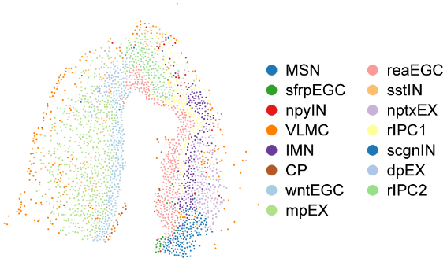
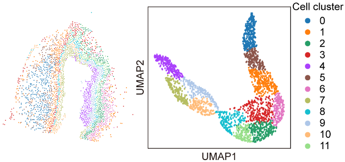
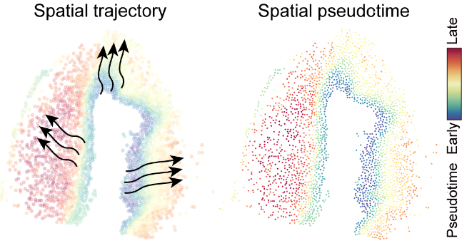
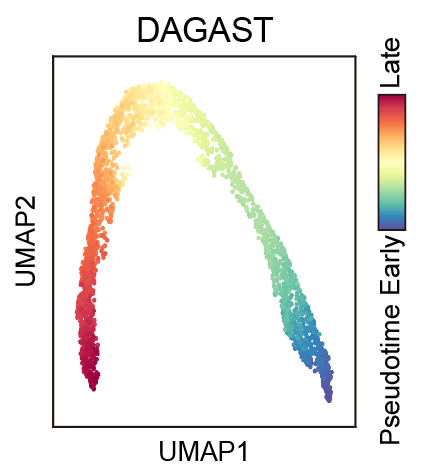
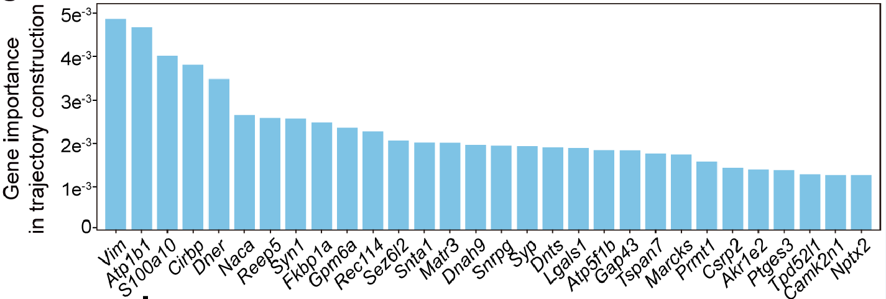
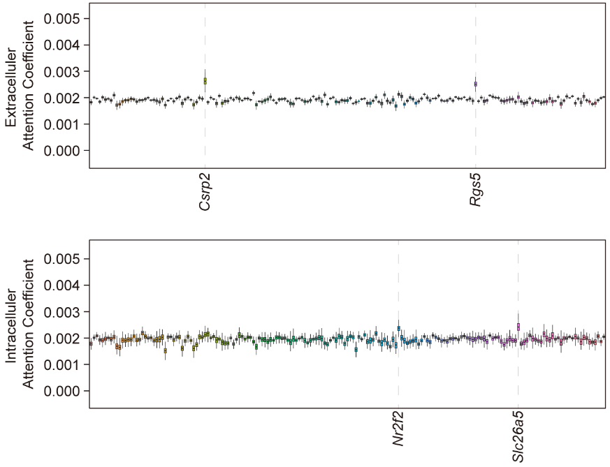

# Tutorial 2: Application on Stereo-seq axolotl telencephalon brain dataset.
In this section, we will demonstrate the use of DAGAST for trajectory inference in Stereo-seq [axolotl telencephalon brain data](https://www.science.org/doi/10.1126/science.abp9444). The original data can be downloaded at https://-db.cngb.org/stomics/artista. We use 15DPI data for demonstration.  

---

### 1.Load DAGAST and set path

    import os 
    import torch
    import numpy as np
    import pandas as pd
    import scanpy as sc
    import seaborn as sns
    import matplotlib.pyplot as plt
    from tqdm import tqdm

    import DAGAST as dt     # import DAGAST

    import warnings
    warnings.filterwarnings("ignore")
    torch.cuda.empty_cache()   

    ## version and path
    sample_name = "DAGAST"
    root_path = "/public3/Shigw/"
    data_folder = f"{root_path}/datasets/Stereo-seq/regeneration/"
    save_folder = f"{data_folder}/results/{sample_name}"
    dt.check_path(save_folder)

### 2.Set Hyperparameters 

    SEED = 24
    knn = 30
    n_genes = 500
    n_neighbors = 9
    n_externs = 10

    dt.setup_seed(SEED)
    torch.cuda.empty_cache()     
    device = torch.device('cuda:1')
    args = {
        "num_input" : n_genes,  
        "num_emb" : 256,        # 256  512
        "dk_re" : 16,
        "nheads" : 1,               #  1    4
        "droprate" : 0.15,          #  0.25,
        "leakyalpha" : 0.15,        #  0.15,
        "resalpha" : 0.5, 
        "bntype" : "BatchNorm",     # LayerNorm BatchNorm
        "device" : device, 
        "info_type" : "linear",  # nonlinear
        "iter_type" : "SCC",
        "iter_num" : 200,

        "neighbor_type" : "noextern",
        "n_neighbors" : 9,
        "n_externs" : 10,

        "num_epoch1" : 1000, 
        "num_epoch2" : 1000, 
        "lr" : 0.001, 
        "update_interval" : 1, 
        "eps" : 1e-5,
        "scheduler" : None, 
        "SEED" : SEED,

        "cutof" : 0.1,
        "alpha" : 1.0,
        "beta" : 0.1,
        "theta1" : 0.1,
        "theta2" : 0.1
    }

### 3.Load dataset
Gene selection:
---
    import os 
    import torch
    import numpy as np 
    import pandas as pd 
    import scanpy as sc 
    import matplotlib as mpl 
    import matplotlib.pyplot as plt 
    from anndata import AnnData
    import PROST 
    import warnings 
    warnings.filterwarnings("ignore") 
    torch.cuda.empty_cache()   

    def check_path(path):
        if not os.path.isdir(path):
            os.mkdir(path)
            print(f'mkdir {path}')
    SEED = 24
    PROST.setup_seed(SEED)

    date = "241202"
    root_path = "/public3/Shigw/"
    data_folder = f"{root_path}/datasets/Stereo-seq/regeneration/"
    save_folder = f"{data_folder}/results/{date}"
    check_path(save_folder)

    st_data = sc.read(f"{data_folder}/st_data.h5")
    st_data.var_names_make_unique()
    n_neighbors = 9
    st_data_use = st_data.copy()
    st_data_use = PROST.prepare_for_PI(st_data_use, platform="stereo-seq")
    st_data_use = PROST.cal_PI(st_data_use, platform="stereo-seq", multiprocess=True)
    df_gene_metadata = st_data_use.var
    df_gene_metadata.to_csv(f"{save_folder}/PI_result.csv")

    st_data = sc.read(data_folder + "/st_data.h5")
    df_data_pi = pd.read_csv(f"{data_folder}/results/PI_result.csv", index_col=0)
    gene_flag = df_data_pi['PI'].nlargest(n_genes).index
    st_data = st_data[:, gene_flag]
    sc.pp.normalize_total(st_data, target_sum=1e4)          
    sc.pp.log1p(st_data)
    sc.pp.scale(st_data)
    st_data_use = st_data.copy()   ## target data 

    ## show data
    dt.plot_spatial_complex(
        st_data, st_data_use, mode="cluster", key="celltypes",
        figsize=(5, 5), title=None, pointsize=5, 
        savename=f"{save_folder_cluster}/spatial_sel_cell.png"
    )

### 4.Building and training the DAGAST model
#### 4.1 Stage 1 training
    save_folder_cluster = f"{save_folder}/2.spatial_cluster/"
    dt.check_path(save_folder_cluster)

    trainer = dt.DAGAST_Trainer(args, st_data, st_data_use) # Build DAGAST Trainer
    trainer.init_train()                                    # Build Model, neighbor
    trainer.train_stage1(f"{save_folder_cluster}/model_{sample_name}_stage1.pkl") 

#### 4.2 Select the starting cell cluster
    ## Select starting area (available separately)
    model = torch.load(f"{save_folder_cluster}/model_{sample_name}_stage1.pkl")
    model.eval()
    emb = model.get_emb(isall=False)
    emb_adata = sc.AnnData(emb)
    emb_adata.obs['celltypes'] = st_data_use.obs['celltypes'].values
    sc.pp.neighbors(emb_adata, use_rep='X', n_neighbors=20)
    sc.tl.umap(emb_adata)
    sc.tl.leiden(emb_adata, resolution=1.0)         # res = 0.1
    print(f"{len(emb_adata.obs['leiden'].unique())} clusters")

    plt.close('all')
    fig = plt.figure(figsize=(10, 10))
    plt.subplot(1, 1, 1)
    ax = sc.pl.umap(emb_adata, color="leiden", color_map='Spectral_r', legend_loc='on data', legend_fontweight='normal')
    plt.savefig(f"{save_folder_cluster}/2.umap_cluster_stage1.pdf", dpi=600)

    st_data_use.obs['emb_cluster'] = emb_adata.obs['leiden'].values
    plt.close('all')
    plt.rcParams["figure.figsize"] = (5, 5)
    ax = sc.pl.embedding(st_data_use, basis="spatial", color="emb_cluster",size=15, s=10, show=False, title='clustering')
    plt.axis('off')
    plt.savefig(f"{save_folder_cluster}/2.spatial_cluster_stage1.pdf", dpi=600, bbox_inches='tight')

#### 4.3 Stage 2 training
    save_folder_trajectory = f"{save_folder}/3.spatial_trajectory/"
    dt.check_path(save_folder_trajectory)

    flag = (st_data_use.obs['emb_cluster'].isin(['4'])).values   

    trainer.set_start_region(flag)                                  # set start region
    trainer.train_stage2(save_folder_trajectory, sample_name)       # Trajectory inference
    trainer.get_Trajectory_Ptime(knn=knn, grid_num=50, smooth=0.5, density=1.0) 

### 5.Plot results
    st_data, st_data_use = trainer.st_data, trainer.st_data_use
    model = trainer.model

    xy1 = st_data.obsm['spatial']
    xy2 = st_data_use.obsm['spatial']

#### 5.1 Spatial differentiation trajectory
    plt.close('all')
    fig, axs = plt.subplots(figsize=(5, 5))
    sns.scatterplot(x = xy2[:, 0], y = xy2[:, 1], marker = 'o', c = st_data_use.obs['ptime'], s=20, cmap='Spectral_r', legend = False, alpha=0.25)
    axs.quiver(st_data_use.uns['E_grid'][0], st_data_use.uns['E_grid'][1], st_data_use.uns['V_grid'][0], st_data_use.uns['V_grid'][1], 
        scale=0.2, linewidths=4, headwidth=5)
    plt.savefig(f"{save_folder_trajectory}/1.spatial_quiver.pdf", format='pdf',bbox_inches='tight')

#### 5.2 Spatial pseudotime
    dt.plot_spatial_complex(
        st_data, st_data_use, mode="time",
        value=st_data_use.obs['ptime'], title="ptime", pointsize=5,
        savename=f"{save_folder_trajectory}/2.spatial_Pseudotime.pdf"
    )

#### 5.3 UMAP visualization of spatial pseudotime
    model.eval()
    emb = model.get_emb(isall=False)
    adata = sc.AnnData(emb)
    sc.pp.neighbors(adata, use_rep='X', n_neighbors=knn)
    adata.obs['ptime'] = st_data_use.obs['ptime'].values
    adata.obs['celltypes'] = st_data_use.obs['celltypes'].values
    sc.tl.umap(adata)

    plt.close('all')
    fig = plt.figure(figsize=(10, 10))
    plt.subplot(1, 1, 1)
    ax = sc.pl.umap(adata, color="ptime", color_map='Spectral_r')
    plt.savefig(f"{save_folder_trajectory}/3.umap_ptime.pdf")

### 6.Downstream analysis

    from utils_function import *

    ######################### 目标数据集 #########################
    sample_name = "DAGAST"
    root_path = "/public3/Shigw"
    data_folder = f"{root_path}/datasets/Stereo-seq/regeneration"
    save_folder = f"{data_folder}/results/{sample_name}"
    check_path(save_folder)

    ######################### 准备数据和模型 ########################
    ##### 导入数据
    st_data = sc.read(data_folder + "/st_data.h5")
    gene_use = pd.read_csv("/public2/yulong/toyuhan/Stereo_seq_gene_names.csv", header=None)[0].tolist()
    st_data = st_data[:, gene_use]
    sc.pp.normalize_total(st_data, target_sum=1e4) # 不要和log顺序搞反了 ，这个是去文库的
    sc.pp.log1p(st_data)
    sc.pp.scale(st_data)

    celltypes_df = pd.read_csv("/public2/yulong/yuhanDir/axolotl_brain_regeneration/Stereo_seq_celltypes.csv", index_col=0) 
    target_cells = celltypes_df.index.tolist()
    mask = st_data.obs_names.isin(target_cells)
    st_data_use = st_data[mask, :]

    ##### 导入模型和迁移矩阵
    SEED = 42
    nu.setup_seed(SEED)
    trj_ori = np.load("/public2/yulong/yuhanDir/axolotl_brain_regeneration/results_Stereo-seq/3.spatial_trajectory/trj_DAGAST.npy")
    model = torch.load("/public2/yulong/yuhanDir/axolotl_brain_regeneration/results_Stereo-seq/3.spatial_trajectory/model_DAGAST.pkl")
    model.eval()

#### 6.1 Gene contribution scores to cell differentiation trajectory reconstruction

    ######################### 置换检验找特征基因 ########################
    save_folder_trajectory = f"{save_folder}/5.regulation_gene/nptxEX"

    ##### 输出nptxEX发育过程的重要基因
    cell_use = st_data_use.obs_names.tolist()
    gene_use = st_data_use.var_names.tolist()

    nu.setup_seed(SEED)
    torch.cuda.empty_cache()
    device = torch.device('cuda:0')
    result_permu = permutation_singlegene_celltype(      # 单个扰动
        model, st_data_use, trj_ori, gene_use, cell_use,
        n_permu=30, epsilon=1e-16, seed=24, device=device
    )
    result_permu_df = pd.DataFrame(result_permu.mean(1), index=gene_use, columns=['total_sim'])
    result_permu_sorted = result_permu_df.sort_values('total_sim', ascending=False)
    result_permu_sorted.to_csv(f"{save_folder_trajectory}/nptxEX_permutation_single_gene.csv")
    result_permu_sorted.head(30)

    ##### 绘制条形图
    result_permu_sorted = pd.read_csv("/public3/Shigw/datasets/Stereo-seq/regeneration/results/DAGAST/5.regulation_gene/nptxEX/nptxEX_permutation_single_gene.csv", index_col=0)
    plt.close('all')
    plt.figure(figsize=(10, 6))
    plt.bar(result_permu_sorted.head(30).index, result_permu_sorted.head(30).total_sim, color='skyblue')
    plt.xticks(rotation=90)
    plt.xlabel('Gene', fontsize=12)
    plt.ylabel('Mean of KL divergence', fontsize=12)
    plt.tight_layout()
    plt.savefig(f"{save_folder_trajectory}/important_genes.pdf")

    
#### 6.2 The synergistic “cell-autonomous and microenvironment interaction” regulatory network

    att_gene_re_all, att_gene_cc_all, att_cell_all = model.get_encoder_attention()
    att_gene_re = att_gene_re_all
    att_gene_cc = att_gene_cc_all
    att_cell = att_cell_all

    save_folder_attention_gene = "/public3/Shigw/datasets/Stereo-seq/regeneration/results/DAGAST/4.gene_attention/3.DEG/0811_GO_Cytoscape"
    nu.check_path(save_folder_attention_gene)

    cell_use = st_data_use.obs_names.tolist()
    gene_use = st_data_use.var_names.tolist()

    ## 提取细胞外gene attention
    att_gene_cc_sel = att_gene_cc
    att_gene_cc_sel_df = pd.DataFrame(np.mean(att_gene_cc_sel, 0), index=gene_use, columns=gene_use)

    ## 提取细胞内gene attention
    att_gene_re_sel = att_gene_re
    att_gene_re_sel_df = pd.DataFrame(np.mean(att_gene_re_sel, 0), index=gene_use, columns=gene_use)

    ## 输出细胞内和细胞外的基因注意力系数矩阵
    att_gene_re_sel_df.to_csv(f"{save_folder_attention_gene}/att_gene_re_sel_df.csv", index=True, header=True)
    att_gene_cc_sel_df.to_csv(f"{save_folder_attention_gene}/att_gene_cc_sel_df.csv", index=True, header=True)

    ## 读入注意力矩阵和差异表达基因
    import pandas as pd
    att_gene_re_sel_df = pd.read_csv("/public3/Shigw/datasets/Stereo-seq/regeneration/results/DAGAST/4.gene_attention/3.DEG/0811_GO_Cytoscape/att_gene_re_sel_df.csv",index_col=0)
    att_gene_cc_sel_df = pd.read_csv("/public3/Shigw/datasets/Stereo-seq/regeneration/results/DAGAST/4.gene_attention/3.DEG/0811_GO_Cytoscape/att_gene_cc_sel_df.csv",index_col=0)

    deg = pd.read_csv("/public3/Shigw/datasets/Stereo-seq/regeneration/results/DAGAST/4.gene_attention/3.DEG/table_s5.txt",sep="\t")
    deg['type'] = deg['Gene GroUp'].str.split('_').str[-1]
    deg_down = set(deg[deg['type'] == 'Down']['Gene Name'])
    deg_up = set(deg[deg['type'] == 'Up']['Gene Name'])

    intersection = list(set(deg_up) & set(att_gene_re_sel_df.columns.values))
    intra_gene_att_up = att_gene_re_sel_df[intersection]
    extra_gene_att_up = att_gene_cc_sel_df[intersection]

    ## 输出基因表达上调的细胞内外注意力系数
    intra_gene_att_up_score = (
        intra_gene_att_up.stack()              # 将矩阵转换为多级索引序列
        .reset_index()          # 将索引转换为列
        .rename(columns={
            'level_0': 'Row',
            'level_1': 'Column',
            0: 'Value'
        })
    )
    intra_gene_att_up_score.to_csv(f"{save_folder_attention_gene}/intra_gene_att_up_score.csv", index=False)
    intra_gene_att_up_score_cytoscape = intra_gene_att_up_score[intra_gene_att_up_score['Row'] != intra_gene_att_up_score['Column']].nlargest(500, 'Value')
    intra_gene_att_up_score_cytoscape.to_csv(f"{save_folder_attention_gene}/intra_gene_att_up_score_cytoscape.csv", index=False)

    extra_gene_att_up_score = (
        extra_gene_att_up.stack()              # 将矩阵转换为多级索引序列
        .reset_index()          # 将索引转换为列
        .rename(columns={
            'level_0': 'Row',
            'level_1': 'Column',
            0: 'Value'
        })
    )
    extra_gene_att_up_score.to_csv(f"{save_folder_attention_gene}/extra_gene_att_up_score.csv", index=False)
    extra_gene_att_up_score_cytoscape = extra_gene_att_up_score[extra_gene_att_up_score['Row'] != extra_gene_att_up_score['Column']].nlargest(500, 'Value')
    extra_gene_att_up_score_cytoscape.to_csv(f"{save_folder_attention_gene}/extra_gene_att_up_score_cytoscape.csv", index=False)

    ## 通过整体的注意力系数找影响最大的基因boxplot
    df <- read.csv("extra_gene_att_up_score.csv",header = T)
    ggplot(df, aes(x=Column,y=Value),color=Column)+
      geom_boxplot(aes(fill=Column),outlier.shape = NA,notch = T) +
      ylab("Extracellular attention coefficient") + xlab("") +
      guides(fill=FALSE) +
      scale_y_continuous(limits=c(0,0.005),breaks=seq(0,0.005,0.001)) +
      background +
      theme(panel.grid =element_blank(),
            axis.text.x =  element_text(size = 6,angle = 45,vjust = 1, hjust = 1, colour = "black"),
            panel.background=element_rect(fill='transparent', color="#000000"))
    df <- read.csv("intra_gene_att_up_score.csv",header = T)
    ggplot(df, aes(x=Column,y=Value),color=Column)+
      geom_boxplot(aes(fill=Column),outlier.shape = NA,notch = T) +
      ylab("Intracellular attention coefficient") + xlab("") +
      guides(fill=FALSE) +
      scale_y_continuous(limits=c(0,0.005),breaks=seq(0,0.005,0.001)) +
      background +
      theme(panel.grid =element_blank(),
            axis.text.x =  element_text(size = 6,angle = 45,vjust = 1, hjust = 1, colour = "black"),
            panel.background=element_rect(fill='transparent', color="#000000"))

---

