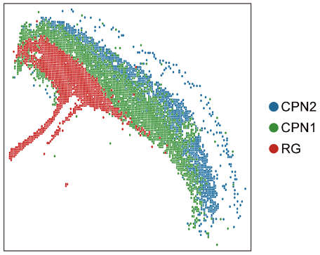
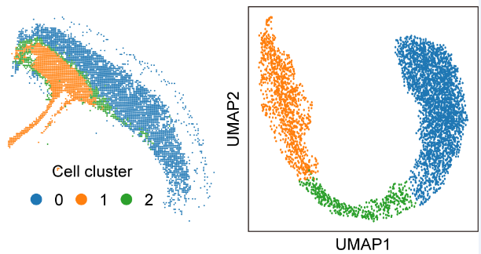
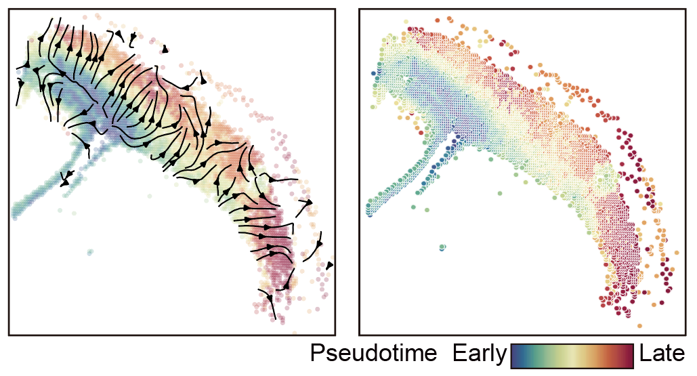
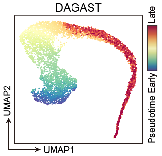

# Tutorial 3: Application on 10x Visium HD mouse cortex dataset.
This section demonstrates the application of DAGAST for trajectory inference on the 10x Genomics Visium HD mouse cortex dataset. The raw data are available from the designated link (https://www.10xgenomics.com/datasets/visium-hd-three-prime-mouse-embryo-fresh-frozen).

---

### 1.Load DAGAST and set path

    import os
    import torch
    import numpy as np
    import pandas as pd
    import scanpy as sc
    import seaborn as sns
    import matplotlib.pyplot as plt
    from tqdm import tqdm
    import DAGAST as dt     # import DAGAST
    import warnings
    warnings.filterwarnings("ignore")
    torch.cuda.empty_cache()

    ## version and path
    sample_name = "DAGAST"
    data_folder_h5ad = "/public2/yulong/yuhanDir/MouseEmbryo/square_016um"
    data_folder_pi = "/public2/yulong/yuhanDir/MouseEmbryo/square_016um"
    data_folder_gene = "/public2/yulong/yuhanDir/MouseEmbryo/square_016um"
    save_folder = "/public3/Shigw/datasets/visiumHD/filteredCPN/results/square_016um_222genes"

    save_folder_cluster = f"{save_folder}/2.spatial_cluster/"
    dt.check_path(save_folder_cluster)

### 2.Set Hyperparameters 

    SEED = 24
    knn = 30
    n_genes = 222 ##修改
    n_neighbors = 9
    n_externs = 10

    dt.setup_seed(SEED)
    torch.cuda.empty_cache()
    device = torch.device('cuda:0')
    args = {
        "num_input" : n_genes,
        "num_emb" : 256,        # 256  512
        "dk_re" : 16,
        "nheads" : 1,               #  1    4
        "droprate" : 0.15,          #  0.25,
        "leakyalpha" : 0.15,        #  0.15,
        "resalpha" : 0.5,
        "bntype" : "BatchNorm",     # LayerNorm BatchNorm
        "device" : device,
        "info_type" : "nonlinear",  # nonlinear
        "iter_type" : "SCC",
        "iter_num" : 200,

        "neighbor_type" : "noextern",
        "n_neighbors" : 9,
        "n_externs" : 10,

        "num_epoch1" : 1000,
        "num_epoch2" : 1000,
        "lr" : 0.001,
        "update_interval" : 1,
        "eps" : 1e-5,
        "scheduler" : None,
        "SEED" : SEED,

        "cutof" : 0.1,
        "alpha" : 1.0,
        "beta" : 0.1,
        "theta1" : 0.1,
        "theta2" : 0.1
    }

### 3.load dataset

    st_data = sc.read_h5ad(data_folder_h5ad + "/MouseEmbryo_Spatial_0826_resolution3_cortexVisium_RG_CR_CPN_CFuPN.h5ad")
    sc.pp.normalize_total(st_data, target_sum=1e4)
    sc.pp.log1p(st_data)
    sc.pp.scale(st_data)
    ## 过滤基因
    st_data.var = st_data.var.set_index(st_data.var.columns[0])
    gene_use = pd.read_csv(f"{data_folder_gene}/Mouse_gene_names.topGene_perc222.csv", header=None)[0].tolist()
    # df_data_pi = pd.read_csv(f"{data_folder_pi}/PI_result.csv", index_col=0)
    # gene_use = df_data_pi['PI'].nlargest(n_genes).index
    st_data = st_data[:, gene_use]
    pd.DataFrame(gene_use).to_csv(f"{save_folder}/MouseEmbryo_gene_use.csv", index=False, header=False)

    ## 过滤细胞
    keyCluster = st_data.obs[st_data.obs['cellType'].isin(["RG","CPN1","CPN2"])]
    mask = keyCluster.index.tolist()
    st_data_use = st_data[mask, :]

    ## show data
    dt.plot_spatial_complex(
        st_data, st_data_use, mode="cluster", key="cellType",
        figsize=(5, 5), title=None, pointsize=5,
        savename=f"{save_folder_cluster}/spatial_sel_cell.png"
    )

### 4.Build DAGAST, train DAGAST
#### 4.1 train_stage1
    trainer = dt.DAGAST_Trainer(args, st_data, st_data_use) # Build DAGAST Trainer
    trainer.init_train()                                    # Build Model, neighbor
    trainer.train_stage1(f"{save_folder_cluster}/model_{sample_name}_stage1.pkl")

#### 4.2 select start region
    ## Select starting area (available separately)
    model = torch.load(f"{save_folder_cluster}/model_{sample_name}_stage1.pkl")
    model.eval()
    emb = model.get_emb(isall=False)
    emb_adata = sc.AnnData(emb)
    emb_adata.obs['cellType'] = st_data_use.obs['cellType'].values
    sc.pp.neighbors(emb_adata, use_rep='X', n_neighbors=5)
    sc.tl.umap(emb_adata)
    sc.tl.leiden(emb_adata, resolution=0.1)         # res = 0.1
    print(f"{len(emb_adata.obs['leiden'].unique())} clusters")

    plt.close('all')
    fig = plt.figure(figsize=(10, 10))
    plt.subplot(1, 1, 1)
    ax = sc.pl.umap(emb_adata, color="leiden", color_map='Spectral_r', legend_loc='on data', legend_fontweight='normal')
    plt.savefig(f"{save_folder_cluster}/2.umap_cluster_stage1.pdf", dpi=600)

    st_data_use.obs['emb_cluster'] = emb_adata.obs['leiden'].values
    plt.close('all')
    plt.rcParams["figure.figsize"] = (5, 5)
    ax = sc.pl.embedding(st_data_use, basis="spatial", color="emb_cluster",size=15, s=10, show=False, title='clustering')
    plt.axis('off')
    plt.savefig(f"{save_folder_cluster}/2.spatial_cluster_stage1.pdf", dpi=600, bbox_inches='tight')

#### 4.3 train_stage2
    save_folder_trajectory = f"{save_folder}/3.spatial_trajectory/"
    dt.check_path(save_folder_trajectory)

    flag = (st_data_use.obs['emb_cluster'].isin(['1'])).values
    trainer.set_start_region(flag)                                  # set start region
    trainer.train_stage2(save_folder_trajectory, sample_name)       # Trajectory inference
    trainer.get_Trajectory_Ptime(knn, grid_num=50, smooth=0.5, density=1.0)

### 5.Display results

    st_data, st_data_use = trainer.st_data, trainer.st_data_use
    model = trainer.model

    xy1 = st_data.obsm['spatial']
    xy2 = st_data_use.obsm['spatial']

#### 5.1 Space trajectory map
    plt.close('all')
    fig, axs = plt.subplots(figsize=(5, 5))
    sns.scatterplot(x = xy2[:, 0], y = xy2[:, 1], marker = 'o', c = st_data_use.obs['ptime'], s=20, cmap='Spectral_r', legend = False, alpha=0.25)
    axs.quiver(st_data_use.uns['E_grid'][0], st_data_use.uns['E_grid'][1], st_data_use.uns['V_grid'][0], st_data_use.uns['V_grid'][1],
        scale=0.2, linewidths=4, headwidth=5)
    plt.savefig(f"{save_folder_trajectory}/1.spatial_quiver.pdf", format='pdf',bbox_inches='tight')

#### 5.2 Spatial pseudo-time
    dt.plot_spatial_complex(
        st_data, st_data_use, mode="time",
        value=st_data_use.obs['ptime'], title="ptime", pointsize=5,
        savename=f"{save_folder_trajectory}/2.spatial_Pseudotime.pdf"
    )

#### 5.3 UMAP of features
    model.eval()
    emb = model.get_emb(isall=False)
    adata = sc.AnnData(emb)
    sc.pp.neighbors(adata, use_rep='X', n_neighbors=knn)
    adata.obs['ptime'] = st_data_use.obs['ptime'].values
    adata.obs['cellType'] = st_data_use.obs['cellType'].values
    sc.tl.umap(adata)

    plt.close('all')
    fig = plt.figure(figsize=(10, 10))
    plt.subplot(1, 1, 1)
    ax = sc.pl.umap(adata, color="ptime", color_map='Spectral_r')
    plt.savefig(f"{save_folder_trajectory}/3.umap_ptime.pdf")

    st_data_use.write(save_folder + "/modified_data.h5ad")

---

