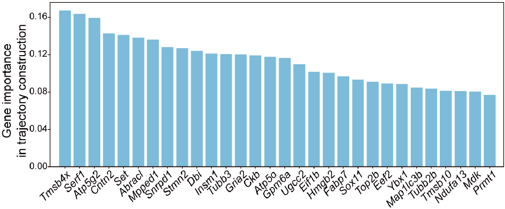
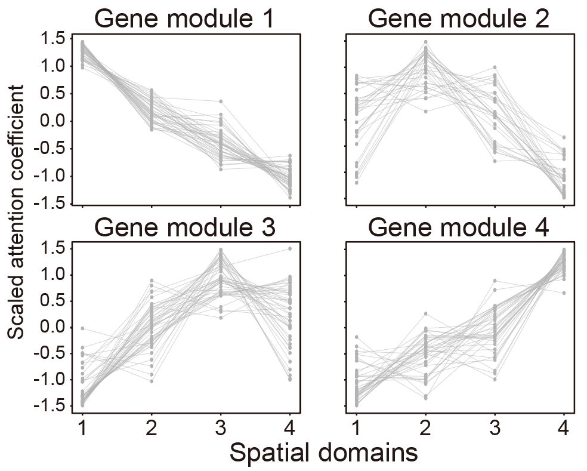
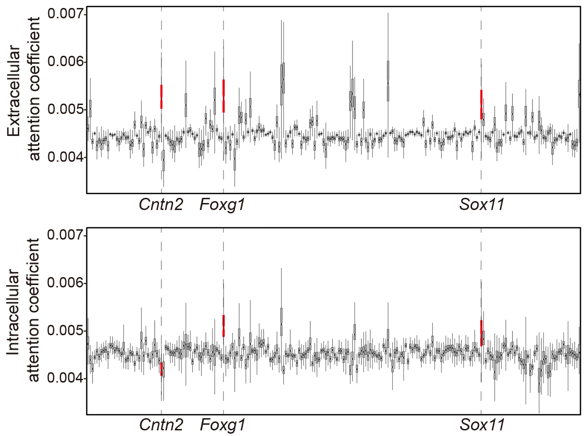

# Tutorial 3: Application on 10x Visium HD mouse cortex dataset.
This section demonstrates the application of Cell-DAG for spatial trajectory inference and regulatory network deciphering on the 10x Genomics Visium HD mouse cortex dataset. The raw data are available from the designated link (https://www.10xgenomics.com/datasets/visium-hd-three-prime-mouse-embryo-fresh-frozen).

---

### 1.Load Cell-DAG and set path

    ## Load Cell-DAG (DAGAST)
    import os
    import torch
    import numpy as np
    import pandas as pd
    import scanpy as sc
    import seaborn as sns
    import matplotlib.pyplot as plt
    from tqdm import tqdm
    import CellDAG as dt     # import CellDAG
    import warnings
    warnings.filterwarnings("ignore")
    torch.cuda.empty_cache()

    ## Version and path
    sample_name = "CellDAG"
    data_folder_h5ad = "/public2/yulong/yuhanDir/MouseEmbryo/square_016um"
    data_folder_pi = "/public2/yulong/yuhanDir/MouseEmbryo/square_016um"
    data_folder_gene = "/public2/yulong/yuhanDir/MouseEmbryo/square_016um"
    save_folder = "/public3/Shigw/datasets/visiumHD/filteredCPN/results/square_016um_222genes"

    save_folder_cluster = f"{save_folder}/2.spatial_cluster/"
    dt.check_path(save_folder_cluster)

### 2.Set Hyperparameters 

    SEED = 24
    knn = 30
    n_genes = 222 ##修改
    n_neighbors = 9
    n_externs = 10

    dt.setup_seed(SEED)
    torch.cuda.empty_cache()
    device = torch.device('cuda:0')
    args = {
        "num_input" : n_genes,
        "num_emb" : 256,        # 256  512
        "dk_re" : 16,
        "nheads" : 1,               #  1    4
        "droprate" : 0.15,          #  0.25,
        "leakyalpha" : 0.15,        #  0.15,
        "resalpha" : 0.5,
        "bntype" : "BatchNorm",     # LayerNorm BatchNorm
        "device" : device,
        "info_type" : "nonlinear",  # nonlinear
        "iter_type" : "SCC",
        "iter_num" : 200,
        "neighbor_type" : "noextern",
        "n_neighbors" : 9,
        "n_externs" : 10,
        "num_epoch1" : 1000,
        "num_epoch2" : 1000,
        "lr" : 0.001,
        "update_interval" : 1,
        "eps" : 1e-5,
        "scheduler" : None,
        "SEED" : SEED,
        "cutof" : 0.1,
        "alpha" : 1.0,
        "beta" : 0.1,
        "theta1" : 0.1,
        "theta2" : 0.1
    }

### 3.Load dataset
    ## Gene selection
    cat /data/public/Gene.annotation/mm10/Mus_musculus.GRCm38.98.gtf | grep -v "^#" | awk '$3=="gene"{print $0;}' | grep "protein_coding" | \
    awk -F'[ ;"]' 'BEGIN{OFS="\t";}{print $13;}' | \
    grep -v "Rpl" | grep -v "Rps" | grep -v "mt-" | grep -v "Hba-" | grep -v "Hbb-" > mm10_GeneName.txt #21804

    import os 
    import torch
    import numpy as np 
    import pandas as pd 
    import scanpy as sc 
    import matplotlib as mpl 
    import matplotlib.pyplot as plt 
    from anndata import AnnData
    from calculate_PI import *
    from utils import setup_seed
    import warnings 
    warnings.filterwarnings("ignore") 
    torch.cuda.empty_cache()     
    def check_path(path):
        if not os.path.isdir(path):
            os.mkdir(path)
            print(f'mkdir {path}')

    data_folder = "/public2/yulong/yuhanDir/MouseEmbryo/square_016um"
    save_folder = "/public2/yulong/yuhanDir/MouseEmbryo/square_016um"
    SEED = 24

    st_data = sc.read_h5ad(data_folder + "/MouseEmbryo_Spatial_0826_resolution3_cortexVisium_RG_CR_CPN_CFuPN.h5ad")
    st_data.var = st_data.var.set_index(st_data.var.columns[0])
    gene_use = pd.read_csv(data_folder + "/mm10_GeneName.txt", header=None)[0].tolist()
    intersection = list(set(st_data.var_names) & set(gene_use))
    gene_use = intersection
    st_data = st_data[:, gene_use]

    keyCluster = st_data.obs[st_data.obs['cellType'].isin(["RG","CPN1","CPN2"])]
    mask = keyCluster.index.tolist()
    st_data_test = st_data[mask, :]

    sc.pp.normalize_total(st_data_test, target_sum=1e4)
    sc.pp.log1p(st_data_test)
    sc.pp.highly_variable_genes(st_data_test, n_top_genes=10000)
    st_data_test = st_data_test[:, st_data_test.var['highly_variable'].values].copy()

    st_data_test1 = prepare_for_PI(st_data_test.copy(), percentage=0.2, platform="visium")
    print(st_data_test1.shape)
    print(st_data_test1.var)
    column_names = st_data_test1.var_names.tolist()
    pd.DataFrame(column_names).to_csv(f"{save_folder}/Mouse_gene_names.topGene_perc222.csv", index=False, header=False) # n_top_genes=10000 percentage=0.2
    
    ## Load data
    st_data = sc.read_h5ad(data_folder_h5ad + "/MouseEmbryo_Spatial_0826_resolution3_cortexVisium_RG_CR_CPN_CFuPN.h5ad")
    sc.pp.normalize_total(st_data, target_sum=1e4)
    sc.pp.log1p(st_data)
    sc.pp.scale(st_data)
    ## 过滤基因
    st_data.var = st_data.var.set_index(st_data.var.columns[0])
    gene_use = pd.read_csv(f"{data_folder_gene}/Mouse_gene_names.topGene_perc222.csv", header=None)[0].tolist()
    # df_data_pi = pd.read_csv(f"{data_folder_pi}/PI_result.csv", index_col=0)
    # gene_use = df_data_pi['PI'].nlargest(n_genes).index
    st_data = st_data[:, gene_use]
    pd.DataFrame(gene_use).to_csv(f"{save_folder}/MouseEmbryo_gene_use.csv", index=False, header=False)

    ## 过滤细胞
    keyCluster = st_data.obs[st_data.obs['cellType'].isin(["RG","CPN1","CPN2"])]
    mask = keyCluster.index.tolist()
    st_data_use = st_data[mask, :]

    ## Show data
    dt.plot_spatial_complex(
        st_data, st_data_use, mode="cluster", key="cellType",
        figsize=(5, 5), title=None, pointsize=5,
        savename=f"{save_folder_cluster}/spatial_sel_cell.png"
    )

### 4.Building and training the DAGAST model
#### 4.1 Stage 1 training
    trainer = dt.DAGAST_Trainer(args, st_data, st_data_use) # Build DAGAST Trainer
    trainer.init_train()                                    # Build Model, neighbor
    trainer.train_stage1(f"{save_folder_cluster}/model_{sample_name}_stage1.pkl")

#### 4.2 Select the starting cell cluster
    ## Select starting area (available separately)
    model = torch.load(f"{save_folder_cluster}/model_{sample_name}_stage1.pkl")
    model.eval()
    emb = model.get_emb(isall=False)
    emb_adata = sc.AnnData(emb)
    emb_adata.obs['cellType'] = st_data_use.obs['cellType'].values
    sc.pp.neighbors(emb_adata, use_rep='X', n_neighbors=5)
    sc.tl.umap(emb_adata)
    sc.tl.leiden(emb_adata, resolution=0.1)         # res = 0.1
    print(f"{len(emb_adata.obs['leiden'].unique())} clusters")

    plt.close('all')
    fig = plt.figure(figsize=(10, 10))
    plt.subplot(1, 1, 1)
    ax = sc.pl.umap(emb_adata, color="leiden", color_map='Spectral_r', legend_loc='on data', legend_fontweight='normal')
    plt.savefig(f"{save_folder_cluster}/2.umap_cluster_stage1.pdf", dpi=600)

    st_data_use.obs['emb_cluster'] = emb_adata.obs['leiden'].values
    plt.close('all')
    plt.rcParams["figure.figsize"] = (5, 5)
    ax = sc.pl.embedding(st_data_use, basis="spatial", color="emb_cluster",size=15, s=10, show=False, title='clustering')
    plt.axis('off')
    plt.savefig(f"{save_folder_cluster}/2.spatial_cluster_stage1.pdf", dpi=600, bbox_inches='tight')

#### 4.3 Stage 2 training
    save_folder_trajectory = f"{save_folder}/3.spatial_trajectory/"
    dt.check_path(save_folder_trajectory)

    flag = (st_data_use.obs['emb_cluster'].isin(['1'])).values
    trainer.set_start_region(flag)                                  # set start region
    trainer.train_stage2(save_folder_trajectory, sample_name)       # Trajectory inference
    trainer.get_Trajectory_Ptime(knn, grid_num=50, smooth=0.5, density=1.0)

### 5.Plot results

    st_data, st_data_use = trainer.st_data, trainer.st_data_use
    model = trainer.model

    xy1 = st_data.obsm['spatial']
    xy2 = st_data_use.obsm['spatial']

#### 5.1 Spatial differentiation trajectory
    plt.close('all')
    fig, axs = plt.subplots(figsize=(5, 5))
    sns.scatterplot(x = xy2[:, 0], y = xy2[:, 1], marker = 'o', c = st_data_use.obs['ptime'], s=20, cmap='Spectral_r', legend = False, alpha=0.25)
    axs.quiver(st_data_use.uns['E_grid'][0], st_data_use.uns['E_grid'][1], st_data_use.uns['V_grid'][0], st_data_use.uns['V_grid'][1],
        scale=0.2, linewidths=4, headwidth=5)
    plt.savefig(f"{save_folder_trajectory}/1.spatial_quiver.pdf", format='pdf',bbox_inches='tight')

#### 5.2 Spatial pseudotime
    dt.plot_spatial_complex(
        st_data, st_data_use, mode="time",
        value=st_data_use.obs['ptime'], title="ptime", pointsize=5,
        savename=f"{save_folder_trajectory}/2.spatial_Pseudotime.pdf"
    )

#### 5.3 UMAP visualization of spatial pseudotime
    model.eval()
    emb = model.get_emb(isall=False)
    adata = sc.AnnData(emb)
    sc.pp.neighbors(adata, use_rep='X', n_neighbors=knn)
    adata.obs['ptime'] = st_data_use.obs['ptime'].values
    adata.obs['cellType'] = st_data_use.obs['cellType'].values
    sc.tl.umap(adata)

    plt.close('all')
    fig = plt.figure(figsize=(10, 10))
    plt.subplot(1, 1, 1)
    ax = sc.pl.umap(adata, color="ptime", color_map='Spectral_r')
    plt.savefig(f"{save_folder_trajectory}/3.umap_ptime.pdf")

    st_data_use.write(save_folder + "/modified_data.h5ad")

### 6.Downstream analysis
    from utils_function import *
    
    ## 目标数据集
    data_folder_h5ad = "/public2/yulong/yuhanDir/MouseEmbryo/square_016um"
    data_folder_gene = "/public3/Shigw/datasets/visiumHD/filteredCPN/results/square_016um_222genes"
    data_folder_model = "/public3/Shigw/datasets/visiumHD/filteredCPN/results/square_016um_222genes/3.spatial_trajectory"
    data_folder_modified = "/public3/Shigw/datasets/visiumHD/filteredCPN/results/square_016um_222genes"
    save_folder = "/public3/Shigw/datasets/visiumHD/filteredCPN/results"
    check_path(save_folder)
    
    ## 导入数据
    st_data = sc.read_h5ad(data_folder_h5ad + "/MouseEmbryo_Spatial_0826_resolution3_cortexVisium_RG_CR_CPN_CFuPN.h5ad")
    st_data.var = st_data.var.set_index(st_data.var.columns[0])
    
    ## 归一化数据
    sc.pp.normalize_total(st_data, target_sum=1e4) # 不要和log顺序搞反了 ，这个是去文库的
    sc.pp.log1p(st_data)
    sc.pp.scale(st_data)
    
    ## 过滤基因和细胞
    model_data = sc.read_h5ad(data_folder_modified + "/modified_data.h5ad")
    cell_use = model_data.obs_names.tolist()
    gene_use = model_data.var_names.tolist()
    st_data = st_data[:, gene_use]
    st_data_use = st_data[cell_use, :]
    
    ## 导入模型和迁移矩阵
    SEED = 42
    nu.setup_seed(SEED)
    trj_ori = np.load(data_folder_model + "/trj_DAGAST.npy")
    model = torch.load(data_folder_model + "/model_DAGAST.pkl")
    model.eval()
    att_gene_re_all, att_gene_cc_all, att_cell_all = model.get_encoder_attention()
    att_gene_re = att_gene_re_all
    att_gene_cc = att_gene_cc_all
    att_cell = att_cell_all
    
#### 6.1 Gene contribution scores to cell differentiation trajectory reconstruction
    save_folder_trajectory = f"{save_folder}/permutation_genes0828new"
    
    ## 输出CPN发育过程的重要基因
    nu.setup_seed(SEED)
    torch.cuda.empty_cache()
    device = torch.device('cuda:0')
    result_permu = permutation_singlegene_celltype(      # 单个扰动
        model, st_data_use, trj_ori, gene_use, cell_use,
        n_permu=30, epsilon=1e-16, seed=24, device=device
    )
    result_permu_df = pd.DataFrame(result_permu.mean(1), index=gene_use, columns=['total_sim'])
    result_permu_sorted = result_permu_df.sort_values('total_sim', ascending=False)
    result_permu_sorted.to_csv(f"{save_folder_trajectory}/CPN_permutation_single_gene.csv")
    result_permu_sorted.head(30)
    
    ## 绘制条形图
    result_permu_sorted = pd.read_csv(f"{save_folder_trajectory}/CPN_permutation_single_gene.csv", index_col=0)
    plt.close('all')
    plt.figure(figsize=(10, 6))
    plt.bar(result_permu_sorted.head(30).index, result_permu_sorted.head(30).total_sim, color='skyblue')
    plt.xticks(rotation=90)
    plt.xlabel('Gene', fontsize=12)
    plt.ylabel('Mean of KL divergence', fontsize=12)
    plt.tight_layout()
    plt.savefig(f"{save_folder_trajectory}/important_genes.pdf")

#### 6.2 The synergistic “cell-autonomous and microenvironment interaction” regulatory network
#### 6.2.1 Spatial domains based on extracellular attention coefficients
    save_folder_attention_gene = "/public3/Shigw/datasets/Stereo-seq/regeneration/results/DAGAST/4.gene_attention/3.DEG/0811_GO_Cytoscape"
    nu.check_path(save_folder_attention_gene)

    ## 提取细胞外gene attention
    att_gene_cc_sel = att_gene_cc
    att_gene_cc_sel_df = pd.DataFrame(np.mean(att_gene_cc_sel, 0), index=gene_use, columns=gene_use)

    ## 提取细胞内gene attention
    att_gene_re_sel = att_gene_re
    att_gene_re_sel_df = pd.DataFrame(np.mean(att_gene_re_sel, 0), index=gene_use, columns=gene_use)

    ## 表达模式
    nu.setup_seed(SEED)
    nc, ng, ng = att_gene_cc_sel.shape
    att_gene_cc_sel_reshape = att_gene_cc_sel.reshape(nc, ng * ng)
    adata_geneatt = sc.AnnData(att_gene_cc_sel_reshape)
    sc.pp.pca(adata_geneatt)
    sc.pp.neighbors(adata_geneatt, n_neighbors=30, n_pcs=50)
    sc.tl.umap(adata_geneatt)
    sc.tl.leiden(adata_geneatt, resolution=0.35)         # res = 0.5
    print(f"{len(adata_geneatt.obs['leiden'].unique())} clusters")
    adata_geneatt.write_h5ad("/public3/Shigw/datasets/visiumHD/filteredCPN/results/spatial_subcluster/adata_geneatt.h5")
    saveFolder_geneAtt_02spatialModule="/public3/Shigw/datasets/visiumHD/filteredCPN/results/spatial_subcluster"
    
    ## 绘制一下UMAP的类别标签
    plt.close('all')
    fig = plt.figure(figsize=(10, 10))
    plt.subplot(1, 1, 1)
    # ax = sc.pl.umap(adata_geneatt, color="leiden", color_map='Spectral', legend_loc='on data', legend_fontweight='normal')
    ax = sc.pl.umap(
        adata_geneatt, color="leiden",
        palette={ci : mycolor[int(idx)] for idx, ci in enumerate(adata_geneatt.obs['leiden'].unique())},
        legend_loc='on data', legend_fontweight='normal')
    plt.savefig(f"{saveFolder_geneAtt_02spatialModule}/2.umap_cluster_cc3.5.pdf")

    ## 是否有空间上连续性 
    st_data_use_sel = st_data_use
    st_data_use_sel.obs['emb_cluster'] = adata_geneatt.obs.leiden.values
    nu.plot_spatial_complex(
        st_data, st_data_use_sel, mode="cluster",
        value=st_data_use_sel.obs['emb_cluster'], title="subcluster",key="emb_cluster",
        savename=f"{saveFolder_geneAtt_02spatialModule}/2.spatial_subcluster3.5.pdf"
    )

#### 6.2.2 Identification of gene modules associated with spatial domains
    geneatts = []
    adata_geneatt_label = ['2', '1', '0', '5',]
    df_gene_attention = pd.DataFrame(index=gene_use)
    for cj in adata_geneatt_label:
        flag_ci = adata_geneatt.obs.leiden == cj
        att_gene_sel_cj = pd.DataFrame(np.mean(att_gene_cc_sel[flag_ci], 0), index=gene_use, columns=gene_use)

        df_gene_attention[cj] = att_gene_sel_cj.sum(0)
        geneatts.append(att_gene_cc_sel[flag_ci])

    result_permu_sorted = pd.read_csv("/public3/Shigw/datasets/visiumHD/filteredCPN/results/permutation_genes0828new/CPN_permutation_single_gene.csv", index_col=0)
    flag = result_permu_sorted.index
    df_gene_attention = df_gene_attention.loc[flag, :]

    row_mean = df_gene_attention.mean(axis=1)
    row_std = df_gene_attention.std(axis=1)
    df_gene_attention = df_gene_attention.sub(row_mean, axis=0).div(row_std, axis=0)

    nu.setup_seed(SEED)
    adata_geneatt_patten = sc.AnnData(df_gene_attention)
    adata_geneatt_patten.var['index'] = [x for x in range(len(adata_geneatt_patten.var_names))]
    sc.pp.neighbors(adata_geneatt_patten, use_rep='X', n_neighbors=30)
    sc.tl.leiden(adata_geneatt_patten, resolution=1.0)         # res = 0.1
    print(f"{len(adata_geneatt_patten.obs['leiden'].unique())} clusters")

    for ci in adata_geneatt_patten.obs['leiden'].unique():
        sub_adata_geneatt = adata_geneatt_patten[adata_geneatt_patten.obs.leiden == ci].copy()
        sub_adata_geneatt = sub_adata_geneatt.T

        plt.close('all')
        fig = plt.figure(figsize=(8, 5))
        plt.subplot(1, 1, 1)

        for cj, gene in enumerate(sub_adata_geneatt.var_names):
            sub_adata_geneatt.obs['plot'] = sub_adata_geneatt[:, gene].X.T[0].tolist()
            plt.plot(sub_adata_geneatt.obs['index'], sub_adata_geneatt.obs['plot'], marker='o', label=gene)

        plt.xticks(np.arange(len(sub_adata_geneatt)), sub_adata_geneatt.obs_names.tolist())
        plt.title(f'gene Patten {ci}')
        plt.xlabel('class')
        plt.ylabel('Att.')
        plt.savefig(f"{saveFolder_geneAtt_02spatialModule}/cc_patten_{ci}.pdf")

        print(ci)

#### 6.2.3 Intracellular and extracellular attention coefficients for feature genes in a given spatial domain
    ## 提取细胞外gene attention
    att_gene_cc_sel = att_gene_cc
    ## 提取细胞内gene attention
    att_gene_re_sel = att_gene_re

    flag_ci = adata_geneatt.obs.leiden == "0"
    att_gene_re_sel_df = pd.DataFrame(np.mean(att_gene_re_sel[flag_ci], 0), index=gene_use, columns=gene_use)
    att_gene_cc_sel_df = pd.DataFrame(np.mean(att_gene_cc_sel[flag_ci], 0), index=gene_use, columns=gene_use)

    ## 输出细胞内和细胞外的基因注意力系数矩阵
    att_gene_re_sel_df.to_csv(f"/public3/Shigw/datasets/visiumHD/filteredCPN/results/spatial_subcluster/att_gene_re_sel_df.csv", index=True, header=True)
    att_gene_cc_sel_df.to_csv(f"/public3/Shigw/datasets/visiumHD/filteredCPN/results/spatial_subcluster/att_gene_cc_sel_df.csv", index=True, header=True)

    ## 读入注意力矩阵和差异表达基因
    intra_gene_att = att_gene_re_sel_df
    extra_gene_att = att_gene_cc_sel_df

    ## 输出基因表达上调的细胞内外注意力系数
    intra_gene_att_score = (
        intra_gene_att.stack()              # 将矩阵转换为多级索引序列
        .reset_index()          # 将索引转换为列
        .rename(columns={
            'level_0': 'Row',
            'level_1': 'Column',
            0: 'Value'
        })
    )
    intra_gene_att_score.to_csv(f"/public3/Shigw/datasets/visiumHD/filteredCPN/results/spatial_subcluster/intra_gene_att_score.csv", index=False)

    extra_gene_att_score = (
        extra_gene_att.stack()              # 将矩阵转换为多级索引序列
        .reset_index()          # 将索引转换为列
        .rename(columns={
            'level_0': 'Row',
            'level_1': 'Column',
            0: 'Value'
        })
    )
    extra_gene_att_score.to_csv(f"/public3/Shigw/datasets/visiumHD/filteredCPN/results/spatial_subcluster/extra_gene_att_score.csv", index=False)

    df <- read.csv("extra_gene_att_score.csv",header = T)
    summary(df$Value)
    ggplot(df, aes(x=Column,y=Value),color=Column)+
      geom_boxplot(aes(fill=Column),outlier.shape = NA,notch = T) +
      ylab("Extracellular attention coefficient") + xlab("") +
      guides(fill=FALSE) +
      scale_y_continuous(limits=c(0.003,0.008),breaks=seq(0.003,0.008,0.001)) +
      background +
      theme(panel.grid =element_blank(),
            axis.text.x =  element_text(size = 6,angle = 45,vjust = 1, hjust = 1, colour = "black"),
            panel.background=element_rect(fill='transparent', color="#000000")) 

    df <- read.csv("intra_gene_att_score.csv",header = T)
    summary(df$Value)
    ggplot(df, aes(x=Column,y=Value),color=Column)+
      geom_boxplot(aes(fill=Column),outlier.shape = NA,notch = T) +
      ylab("Intracellular attention coefficient") + xlab("") +
      guides(fill=FALSE) +
      scale_y_continuous(limits=c(0.003,0.008),breaks=seq(0.003,0.008,0.001)) +
      background +
      theme(panel.grid =element_blank(),
            axis.text.x =  element_text(size = 6,angle = 45,vjust = 1, hjust = 1, colour = "black"),
            panel.background=element_rect(fill='transparent', color="#000000"))

---

