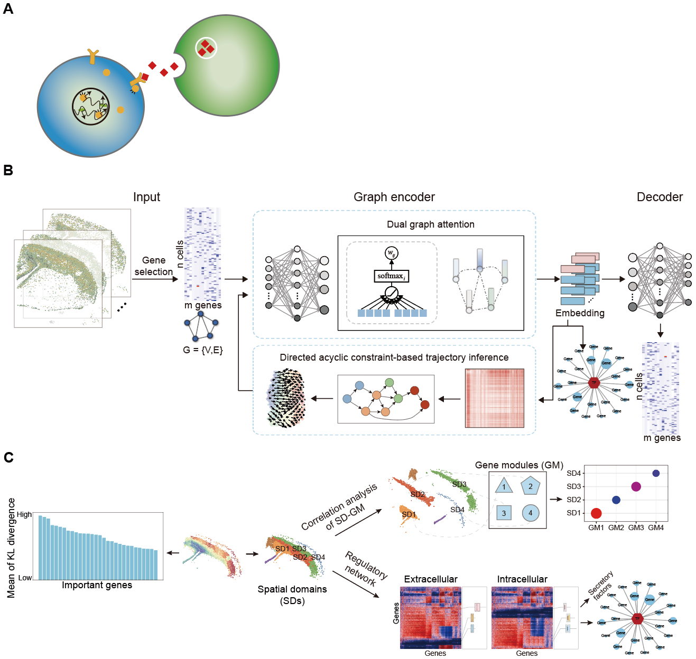

# DAGAST: Dual Attention-based Graph Autoencoder for Spatial Trajectory Inference
## Overview

**DAGAST** is an interpretable deep learning model designed to decipher cellular developmental trajectories and their regulatory networks from spatial transcriptomics data. By synergistically integrating extracellular microenvironmental signals and intracellular gene regulatory information through a dual-branch attention mechanism, DAGAST accurately infers cell fate transitions and identifies key functional genes and spatial domains governing biological processes.

---

## Tutorial

We obtained high-quality real spatial transcriptomics datasets covering three sequencing platforms from public databases and demonstrate the capability of DAGAST in spatial trajectory inference and spatial pseudotime calculation.

[Tutorial 1: Application on the SeqFISH dataset of early mouse embryonic development (GSE197353).](./Tutorial/SeqFISH-pipeline.md)  
[Tutorial 2: Application on the Stereo-seq dataset of axolotl brain regeneration (CNP0002068).](./Tutorial/Stereo-seq-pipeline.md)  
[Tutorial 3: Application on the Visium HD dataset of the mouse cerebral cortex (10x genomics).](./Tutorial/VisiumHD-pipeline.md)

---

## Installation

We use Python 3.8 in the conda environment. The versions of the main dependencies are shown in [requirements.txt](./requirements.txt).

## Reference and Citation

Development  and application of a dual-branch mechanism-based algorithm for inferring spatial differentiation trajectories of cells in tissues

## Improvements

We welcome any comments about DAGAST, and if you find bugs or have any ideas, feel free to leave a comment FAQ. DAGAST doesn't fully test on macOS.

